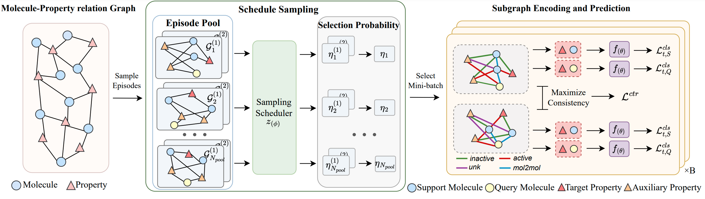

# GS-Meta

This repository is the official implementation of **GS-Meta** proposed in: **Graph Sampling-based Meta-Learning for Molecular Property Prediction, IJCAI 2023**.


<div align=center>
</div>


## Environment
To run the code successfully, the following dependencies need to be installed:
```
python           3.7
torch            1.7.1
rdkit            2022.9.3
learn2learn      0.1.6
torch_geometric  1.6.3
torch_scatter    2.0.7
```

## Step-by-step guidelines

### Datasets
For data used in the experiments, please download `data.zip` from the [release](https://github.com/HICAI-ZJU/GS-Meta/releases) page in this repo, then extract the downloaded file and save the contents in the `data` directory.

### Project Overview

This project mainly contains the following parts.

```
├── data                              # dataset files                 
│   ├── sider                       
│   │   ├── sider.csv    
│   ├── tox21                 
│   │   ├── tox21.csv  
│   └── ...
├── datasets                        
│   ├── __init__.py
│   └── ...
├── models                        
│   ├── __init__.py
│   └── ...
├── pretraiend                        # pretrained GNN
│   ├── supervised_contextpred.pth
├── args_parser.py                      
├── explight.py                      
├── meta_learner.py                    
└── run.py                        
```

### Running Script

```sh
 python run.py --dataset sider --n_support 10 --gpu 0 
```
Running parameters and descriptions are as follows:

| Parameter | Description | Default Value | Choices |
| --- | --- | --- | --- |
| dataset | name of dataset | sider | `tox21, sider, muv, pcba, toxcast-APR, toxcast-ATG, toxcast-BSK, toxcast-CEETOX, toxcast-CLD, toxcast-NVS, toxcast-OT, toxcast-Tanguay, toxcast-TOX21` |
| n_support | number of support molecules | 10 | `1, 10`
| gpu | which GPU to use | 0 | \ |
| exp_name | experiment name | None | \ |
| exp_id | experiment ID | None | \ |
| eval_step | evaluation interval | 100 | \ |

For Pre-GS-Meta, which is initialized with a pretrained GNN, the running script is:


```sh
 python run.py --dataset sider --n_support 10 --gpu 0 --mol_pretrain_load_path pretrained/supervised_contextpred.pth
```


## References
If you use or extend our work, please cite the paper as follows:

```bibtex
@InProceedings{zhuang2023graph,
  title={Graph Sampling-based Meta-Learning for Molecular Property Prediction},
  author={Xiang Zhuang and Qiang Zhang and Bin Wu and Keyan Ding and Yin Fang and Huajun Chen},
  booktile={IJCAI},
  year={2023}
}
```
